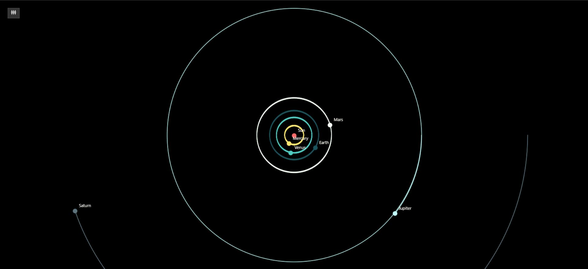
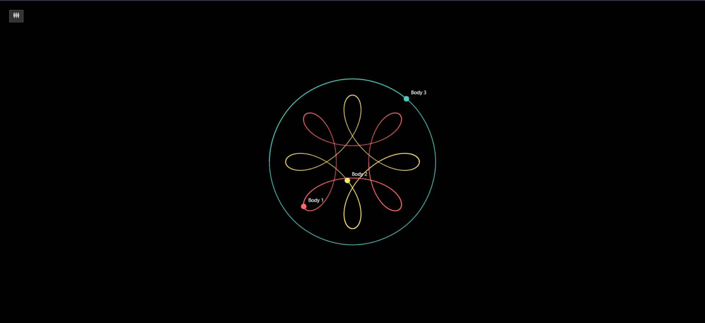
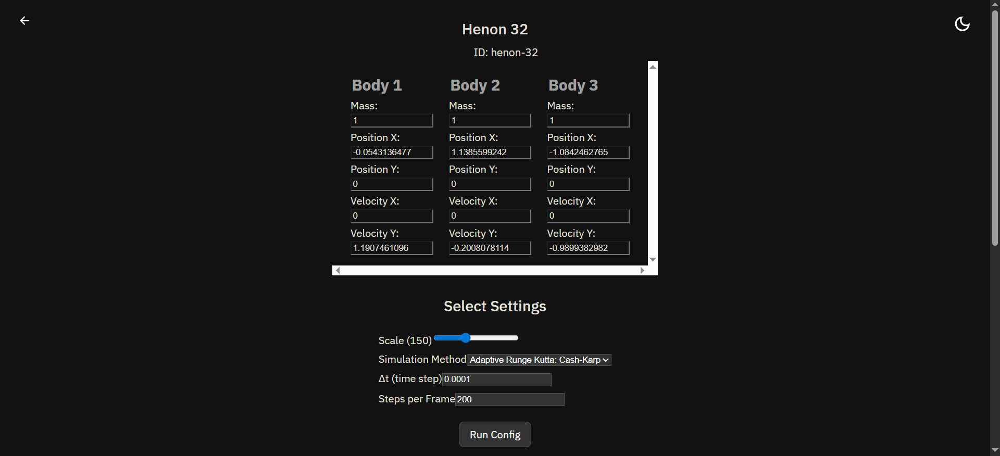

# tó sýmpan — N-Body and Three-Body Simulations

This project began as a small collection of well-known three-body orbits. Over time it became a general N-Body simulator with multiple numerical methods and a simple interface for exploring different systems. The idea is to show how gravitational interactions behave when simulated with reasonable accuracy inside the browser.

---

## Contents

The app has two main sections.

### 1. Three-Body Configurations
A set of classical and modern initial conditions, including:

- Euler’s collinear solutions
- Periodic orbits discovered numerically in the last few decades
- Some unstable or chaotic configurations that are included for completeness

Some orbits simulate cleanly for several cycles. Others drift because of numerical sensitivity or because accurate long-term behavior is difficult to preserve without advanced techniques. They are still included because of their historical or mathematical relevance.

### 2. N-Body Configurations
General gravitational systems with adjustable methods and settings.  
You can load predefined setups and observe how the configuration evolves over time.

---

## Integrators

The simulator includes several methods:

- RK2 (Midpoint)
- RK4
- Velocity Verlet
- Cash-Karp RK45 (adaptive step)

Most configurations load with a method that performs well for that specific system, but you can switch to any method from the UI.

---

## Themes

Light and dark themes are supported.

---

## Tech Stack

- React + Vite  
- Canvas renderer  
- Handwritten physics engine (no external physics libraries)  
- Modular .js configuration files for all orbits and integrators

---
## Live Link

to-sympan.vercel.app

## Screenshots








## Running the Project

```bash
npm install
npm run dev
